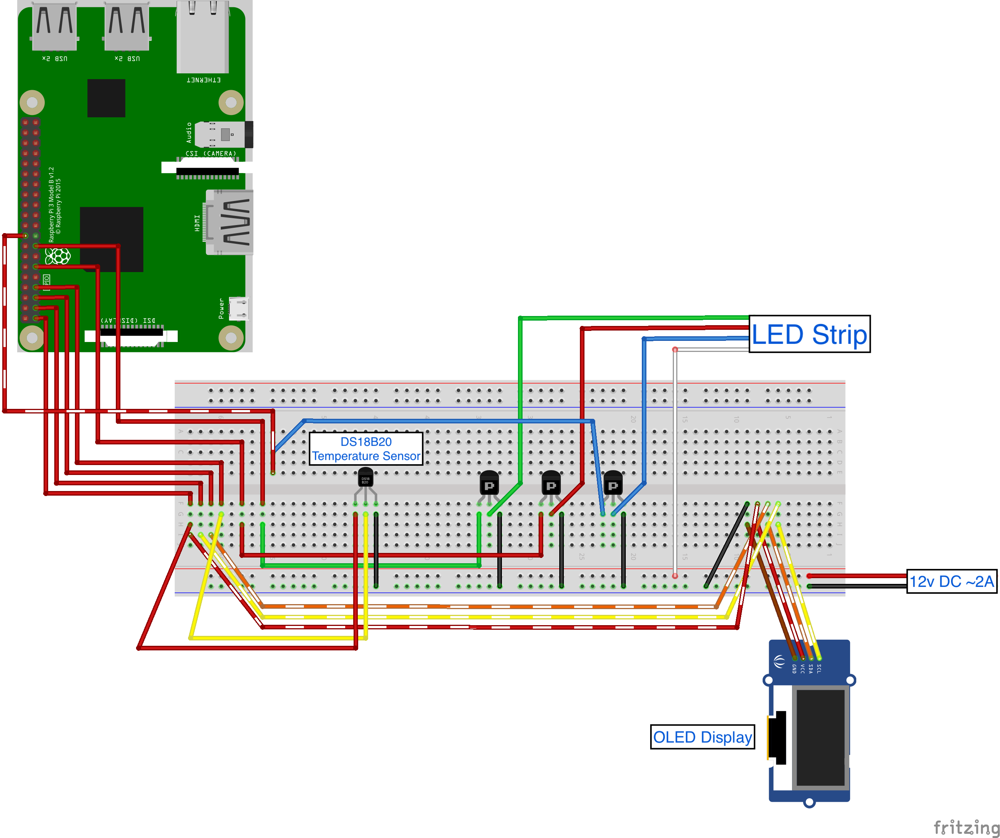

# Temperature Lights

---
## Overview
This IoT project uses a Raspberry Pi with a LED strip that changes color according to a specified ambient temperature. It also uses a small OLED LCD screen to display the current temperature in centigrade and farenheit, as well as the current LCD color and brightness.

## Background
This project was created for Valencia's 202120 Seminar in Advanced Software Development (CEN-4930C). The focus of the project is a "DIY IoT" - Do It Yourself Internet of Things, with a focus of developing software for specific hardware.

From thew IBM [webstie](https://www.ibm.com/blogs/internet-of-things/what-is-the-iot/), "the Internet of Things is the concept of connecting any device (so long as it has an on/off switch) to the Internet and to other connected devices. The IoT is a giant network of connected things and people – all of which collect and share data about the way they are used and about the environment around them."

This project seeks to assemble individual sensors (inputs) and actuators (outputs) all communicating through a cloud-based server via the MQTT protocol. First, it implements a DS18B20 temperature sensor, the reading of which will be converted into a color code to light up a strip of LED lights and, at the same time, display the temperature and the color on a small OLED display.

## Project considerations
This project is perhaps a re-hashed proof-of-concept. There are many Commercial Off-The-Shelf products that will essentially perform the same tasks of this project. This project seeks to understand and implement the inner workings of such products, considering both the hardware and software aspects.

## Limitations
IoT devices are meant to work with little to no user interaction, other than powering the device on. This project, however, requires user interaction. The main reason for this limitation is the inability to run the PiGPIO service on boot. 

## Acknowledgments
The development of this project would not have been possible without the help of countless tutorials and hardware enthusiasts who selflessly shared their knowledge on the web including, but not limited to those found in:

[Albert Herd](https://albertherd.com/)

[EMQ X](https://www.emqx.io/)

[LearnAITech](https://learnaitech.com/)

[LinuxConfig.org](https://linuxconfig.org)

[LinuxCursor.com](https://linuxcursor.com)

[Lua Software Code](https://code.luasoftware.com/)

[Program Creek](https://www.programcreek.com)

[Python Package Index](https://pypi.org)

[Raspberry Pi Tutorials](https://tutorials-raspberrypi.com)

[Raspberry Spy](https://www.raspberrypi-spy.co.uk/)

[Stack Overflow](https://stackoverflow.com)

[Taygan Rifat](https://www.taygan.co)

[Woolsey Workshop](https://www.woolseyworkshop.com)

And, last but not least, all those coders who graciously share their useful repos on [Github](https://github.com)

---

## The Project

---

### Project resources

#### _Hardware_
[Raspberry Pi 3 Model B](https://www.raspberrypi.org/products/raspberry-pi-3-model-b/). I happened to have the Rev 1.2 version, which I bought back in 2017 for no other reason than it would be cool to have. I am sure that the project can be easily implemented on newer Raspberry Pi models.

- [Breadboard Kit](https://www.amazon.com/gp/product/B07DL13RZH)

- Jumper wires: [Male-to-Male](https://www.amazon.com/gp/product/B005TZJ0AM) and [Male-to-Female](https://www.amazon.com/gp/product/B01L5UKAPI)

- [GPIO Breakout Expansion Board with Ribbon Cable](https://www.amazon.com/gp/product/B0761NYF6Y)

- [RAB Holder](https://www.amazon.com/gp/product/B07C7FQDPG)

For the LED lights component of the project
- [LED Strip lights](https://www.amazon.com/gp/product/B07PLNDJ2N)

- [N-Channel MOSFET transistors](https://www.amazon.com/gp/product/B07MW1N4Q5)

- [12V DC ~2A power supply](https://www.amazon.com/gp/product/B00KZ2ZQE8)

- [Power jack](https://www.amazon.com/gp/product/B015OCV5Y8)

For the LCD display component of the project
- [I2C IIC SPI Serial 128x64 Yellow & Blue](https://www.amazon.com/gp/product/B06XRCQZRX)

Temperature Sensor
- [DS18B20 Temperature Sensor Module Kit](https://www.amazon.com/gp/product/B087JQ6MCP)

#### _Software_
- [Ubuntu Server 20.04 on the Raspberry Pi](https://linuxconfig.org/install-ubuntu-20-04-on-raspberry-pi). I've had this version of Ubuntu installed on the RPi for a while now, just sitting there as a testing webserver for personal projects.

- [Python3](https://www.python.org/downloads/release/python-394/).

- Your favorite text editor or IDE. I used [PyCharm Professional IDE](https://www.jetbrains.com/pycharm/) (all of JetBrains products are free for students) on my MacBook Pro. I connected to my RPi via SSH and copied my work files to the RPi for testing. I found this to be easier than setting up the RPi with a separate KVM solution.

- [PiGPIO Library](http://abyz.me.uk/rpi/pigpio/)

- [python-smbus](https://pypi.org/project/smbus2/)

- [MQTT Python client](https://pypi.org/project/paho-mqtt/)

- [fritzing](https://fritzing.org/). Unfortunately, this is not free software. While it is not essential for the project, it is a great tool that helped me create the breadboard diagram.


---
[move to challenges] - I was surprised that no specific libraries were required for the DS18B20 temperature sensor. However, all of the tutorials expected that I edit a boot configuration file that apparently only exists in Raspbian. For Ubuntu, it took me a lot of researching to find the correct file where to make the required edits. I am not a Linux pro, so this aspect of the project was both frustrating and challenging at the same time.

---

### Project Set Up

#### _Schematic_



#### _Hardware_

__DS18B20 Temperature Sensor__. I was surprised that no specific software libraries were required for the DS18B20 temperature sensor. However, all of the tutorials expected that I edit a boot configuration file that apparently only exists in Raspbian. It took a lot of researching to find the correct file where to make the required edits with Ubuntu 20.04. I am not a Linux pro, so this aspect of the project was both frustrating and challenging at the same time.

For Ubuntu:

```
$ sudo nano /boot/firmware/usercfg.txt
```

And add the following:

```
# Enable OneWire Protocol
dtoverlay=w1-gpio

# Specify the GPIO data pin to use
gpiopin=4

# (Optional) Speed up OLED display
dtparam=i2c_baudrate=1000000
```

#### _Software_

This section assumes that you have a Raspberry Pi 3 Model B with Ubuntu LTS 20.04 installed and updated.

1. Install python3 and required modules
   ```
   $ sudo apt install python3 python3-dev python3-pip python3-pil python3-pip python3-setuptools python3-rpi.gpio build-essential unzip wget gcc make git scons swig i2c-tools
   ```

2. Install PiGPIO
   ```
   $ wget http://github.com/joan2937/pigpio/archive/master.zip && unzip master.zip && cd pigpio-master && make && sudo make install
   ```

3. RPLCD library to display data on the LCD display
   ```
   $ pip3 install RPLCD
   ```

4. MQTT Python package for creating publisher and subscriber
   ```
   $ sudo pip3 install paho-mqtt
   ```
 

## Challenges

### MQTT

Unfortunately, I was unable to integrate the MQTT protocol for publishing and subscribing to the temperature data. I was successful in my early attempts, but once I tried to integrate it with the main code, I was unable to successfully exchange data via the broker. Data was being published, but no data was received from the subscribe client.

### NeoPixels

One of the most fun things about this project was the potential to play around with NeoPixels. Although the LED strip serves its purpose to represent the temperature with colored lights, it lacks the animation capabilities offered by NeoPixels. My attempts to incorporate NeoPixels was not successful. Although I was able to connect the NeoPixels to the RPi and was able to control them, my attempts to have both the LED strip and the NeoPixels was overly ambitios. I am sure that with more time I could have worked out the kinks, but I settled (for now) to use only the LED strip.


